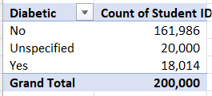

# Medical-Student-Metrics-Analysis

# INTRODUCTION
In this comprehensive analysis of medical student data, I delve into essential demographic and health factors, unearthing valuable insights by constructing pivot tables. These tables include information such as the average age, BMI, temperature, heart rate, blood pressure, and cholesterol levels for both men and women. Additionally, I provide precise statistics on height and weight, a detailed breakdown of blood types, and a thorough overview of the smoking and diabetes status of the students.
## Medical Students on Housemanship at Federal Medical Centre XYZ
The task is to create Pivot Tables displaying the following:
1.	Average values for the following for Male and Females (Age, BMI, Temperature, Heart Rate, Blood Pressure, and Cholesterol)
2.	Average Height and Weight for both Genders (in 2 decimal places)
3.	Number of students across the different Blood Groups
4.	Number of Students who smoke and those who don't
5.	Number of Students who have diabetes and those who don't.
6.	Visualize the insights gotten from the Pivot Table

   ## PROBLEM STATEMENTS
   The main objective of this analysis is to investigate a dataset containing demographic information, health indicators, and lifestyle preferences of medical students with the aim of deriving significant insights. We seek to comprehend the distinctions between male and female students, blood group distributions, smoking habits, and the prevalence of diabetes.
## Skills and Manipulations of Data
   The analysis had demonstrated a range of essential data analysis skills, such as:
.	Data extraction
.	Data Cleaning and Transformation
.	Statistical measures and conditional logic to make data-driven decisions.
.	Excel functions (e.g., AVERAGEIF)
. Pivot Table Creation and Analysis
.	Data Visualization
## DATA SOURCE
The data used for this indepth analysis was provided by an instructor in a Data Anlalysis training as part of the requirement in fulfillment of training. The data set encompasses the information ranging from age, weight, BMI, blood pressure, height, smoking habit, blood group, gender, students ID etc of medical students on housemanship at a reknown federal medical centre 'XYZ'.
## DATA TRANSFORMATION
After importing the CSV data into Microsoft Excel, the dataset was cleaned to resolve missing values, removing more than 40,000 blanks. To ensure data accuracy, data validation and verification were done thereafter.

## PIVOT TABLE ANALYSIS REPRESENTATION
#### Analysis of the Average BMI, Age, Cholestrol, Blood Pressure, Heart Rate and Temperature of Medical Student

###  Pivot table analysis for Diabetic, Smoking and (Height and weight)
**Diabetic**          |        **Smoking**                    |                      **Height and Weight**
:----------------------:|:----------------------------------------:|:------------------------------------
    |                      |
---------------------------------------------------------------------------------------------------------

## VISUALISATION AND ANALYSIS
From the various data that were analysed from the Pivot Table, the following visuals were obtained:

---------------------------------------------------------------------------------------------------

--------------------------------------------------------------------------------------------------

---------------------------------------------------------------------------------------------------

--------------------------------------------------------------------------------------------------

---------------------------------------------------------------------------------------------------

# CONCLUSION AND RECOMENDATION
Conclusions and Recommendations
1.	Clarify "Unspecified" Category: Investigate and categorize the 20,000 unspecified cases in the dataset to gain a comprehensive understanding of their smoking status, enabling informed decisions and targeted support.
2.	Determine Smoking Status: Establish a process to reach out to students in the "Unspecified" category to determine their smoking status (smokers, non-smokers, or former smokers) through surveys, interviews, or self-reporting mechanisms.
3.	Implement Smoking Cessation Programs: With 36,029 identified smokers, there's an opportunity to implement smoking cessation programs within the medical student community. These programs should include counseling, access to nicotine replacement therapy, educational materials, and support groups.
4.	Diabetes-Specific Health Education: Provide diabetes-specific health education and monitoring programs for the 18,014 diabetic students, emphasizing self-care, regular glucose monitoring, and lifestyle management.
5.	Healthier Meal Choices: Collaborate with campus cafeterias to offer healthier, diabetes-friendly meal options and provide nutritional information, promoting improved dietary choices for diabetic students.
6.	Periodic Data Updates: Periodically update the data and conduct follow-up assessments to track changes in smoking and diabetes status, as well as the effectiveness of intervention programs.
These recommendations aim to enhance the understanding of student health and well-being, provide targeted support, and improve overall health outcomes within the medical student community.
# ALSO, MAKE YOUR FOOD YOUR MEDICINE BEFORE YOUR MEDICINE BECOMES YOUR FOOD.
 your health            |        your priority                  |     
:----------------------:|:----------------------------------------:
    |                  
------------------------------------------------------------------

#   THANK YOU! ⚕️

